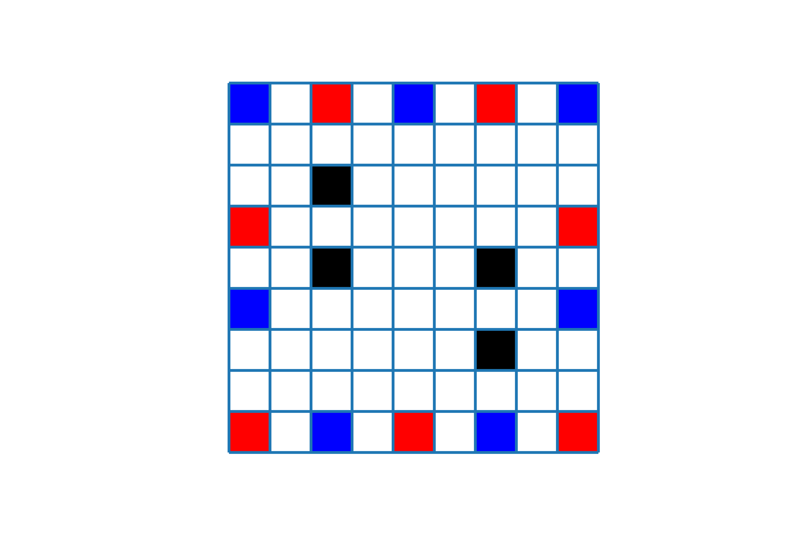

# 围攻棋
## 棋盘
- 9*9大小
- 内部7*7范围内中心对称产生两组（4个）障碍物
- 初始状态：
## 规则
- 交替行棋，一次移动一枚棋子，可朝上/下/左/右走一步
- 如果一个棋子的邻近4格中有不少于两颗对方棋子，这个棋子就被吃掉。类似围棋，棋子如果可吃掉对方棋子，就可以下在没有“气”的地方
- 胜负条件：一方吃完另一方的所有棋子，若双方都无法吃掉对方棋子（比如都只剩一枚棋子）则和棋。
